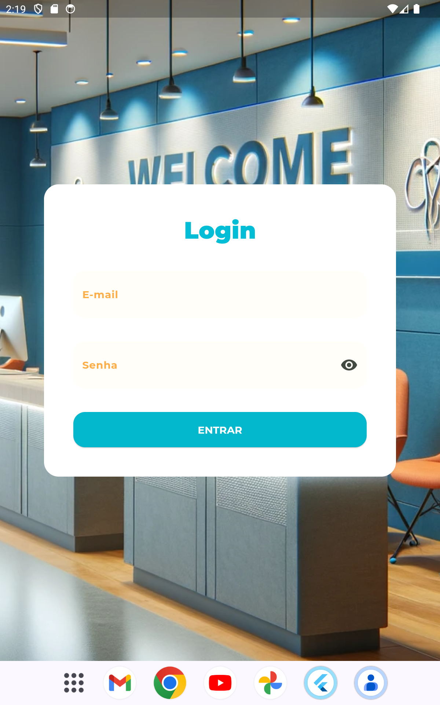
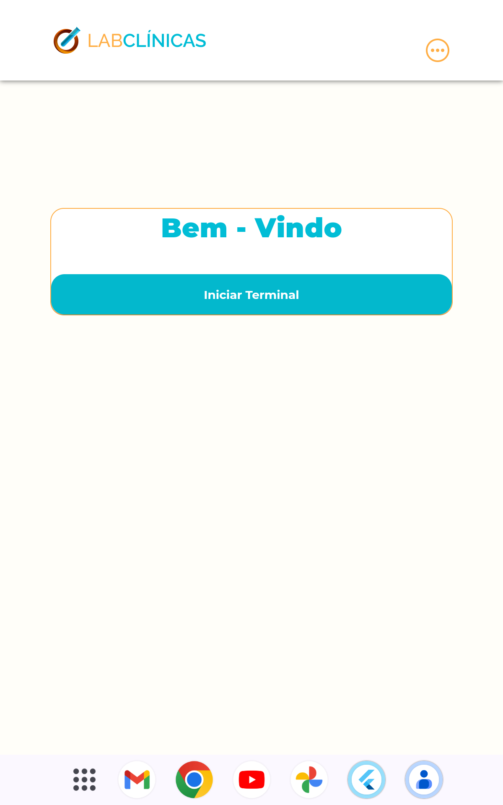
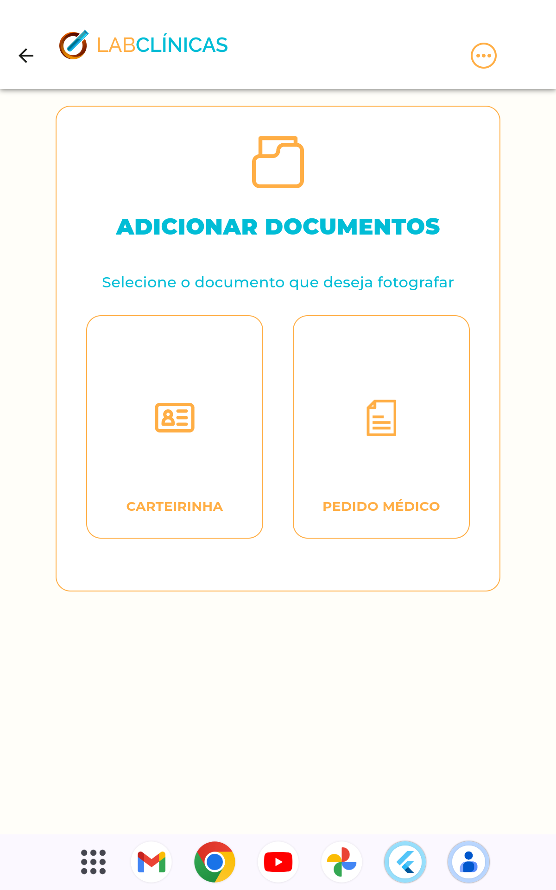

# fe_lab_clinicas_self_service

Evento Flutter Expirience

## Inicio

&nbspEste porjeto foi desenvolvido durante o evento do flutter expirience. Um evento Redigido por Rodrigo Rhama Atualmente GDE flutter Brasil. Neste projeto, o objetivo era criar um app para clincas onde o paciente possa se auto atender. 

## O que foi utilizado no projeto

&nbsp Neste projeto em si. Foi utlizado da arquitetura MVVM(Model view Model), com os principais pacotes sendo o flutter_getit para injeção de depências, e o signals para gerancia de estado da aplicação. Logo abaixo tem uma lista com todos o pacotes utlizados, além do nosso próprio pacote criado durante o evento com o núcleo de funcioanemto principal.   
Lista de pacotes utilizados:
<ul>
  <li>flutter_getit: ^2.0.0</li>
  <li>asyncstate: ^2.1.1-dev.1</li>
  <li>dotted_border: ^2.1.0</li>
  <li>validatorless: ^1.2.3</li>
  <li>signals_flutter: ^3.0.0</li>
  <li>dio: ^5.4.0</li>
  <li>shared_preferences: ^2.2.2</li>
  <li>json_annotation: ^4.8.1</li>
  <li>brasil_fields: ^1.14.2</li>
  <li>camera: ^0.10.5+9</li>
</ul>

Pacote criado durante o evento:

- [Lab Clinicas Core](#https://github.com/emanuelxenos/lab_clinicas_core)

## Capturas de telas do projeto desenvolvido

